# BaggageStorage
This project is designed for check-in and check-out baggage in storage rooms. The project supports more than one workplace, the system administrator only needs to register the client enterprise, assign an administrator, and then register employees, assign them roles, or delegate this to the administrator.

## First of all, you need to log in through the developer account
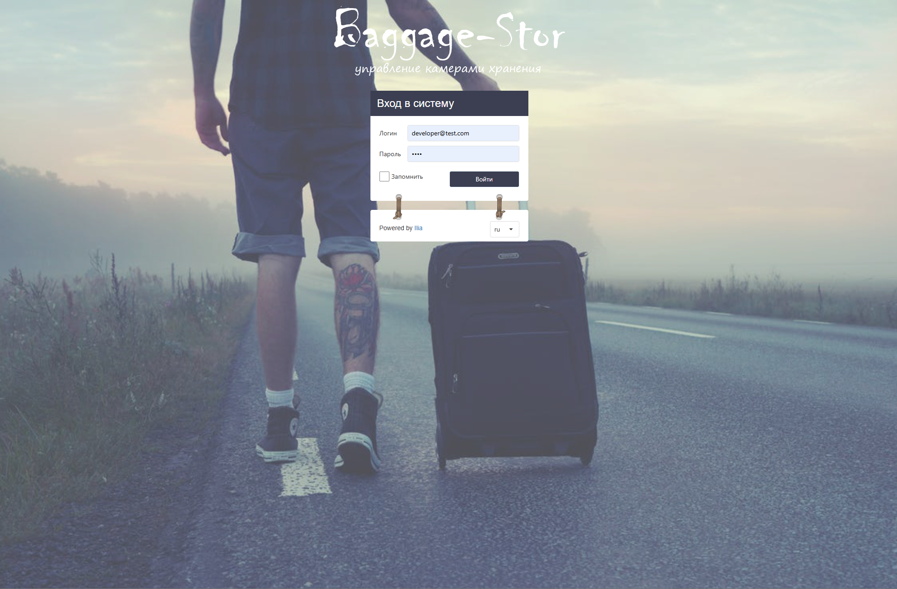

## The first thing you need to do in the application is add a company
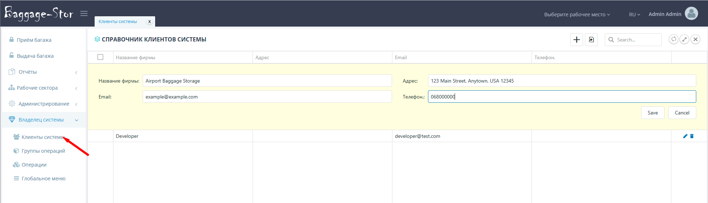

## Then add a new role for the created company
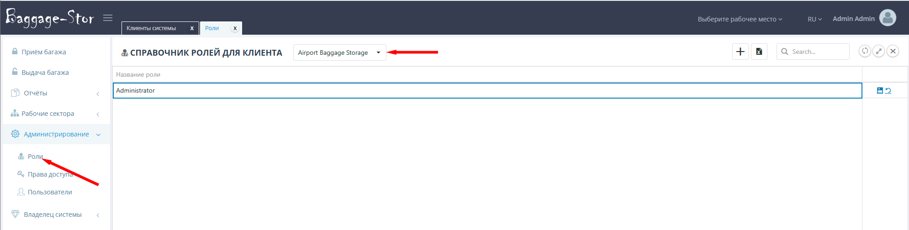

## Set access rights for the created role
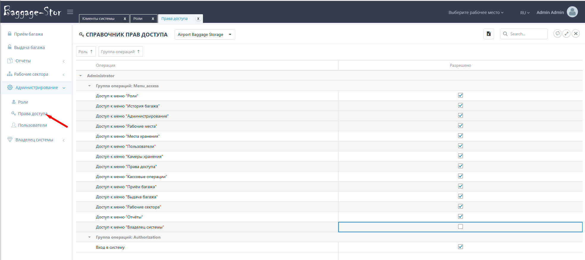

## Create a company administrator account and assign the role
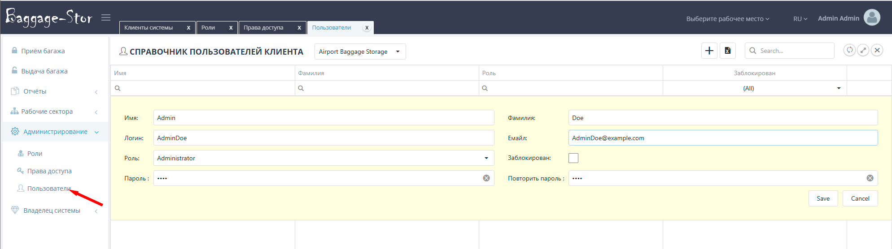

## The administrator can log in and create a workstation
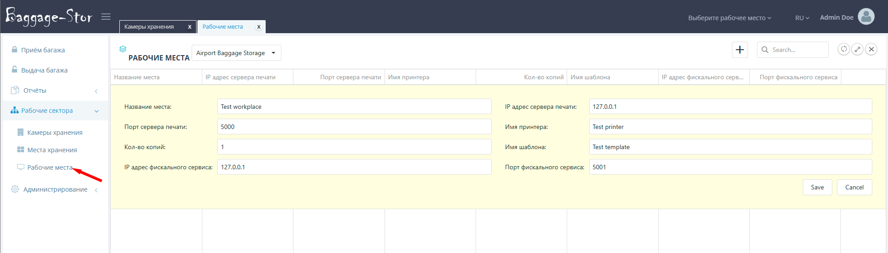

## Administrator creates new storage
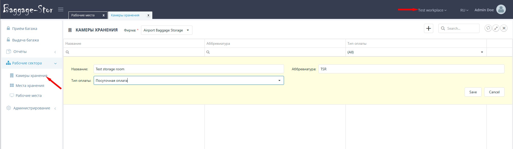

## Then the administrator creates storage rooms
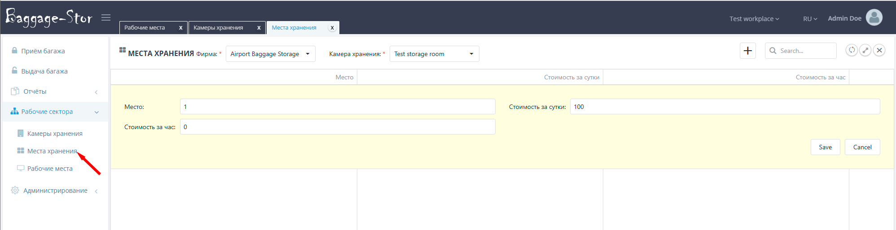

## The admin creates an employee account by first creating a role and assigning access rights

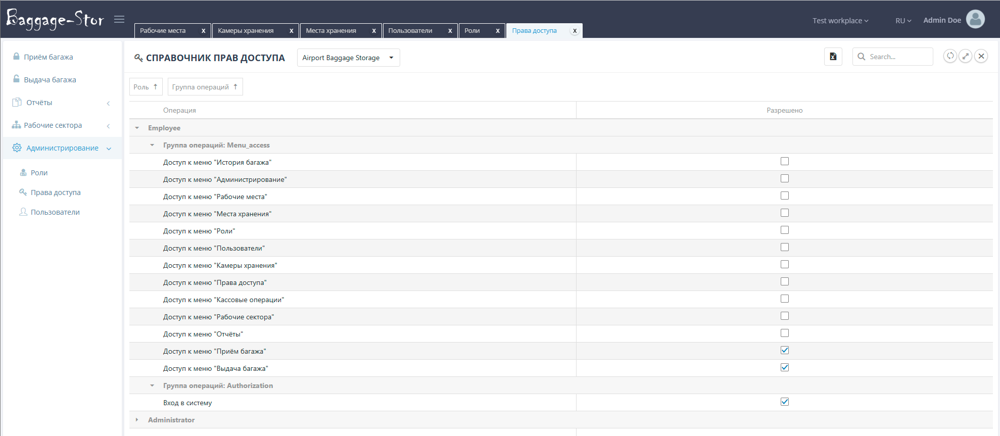

## The employee can start his work
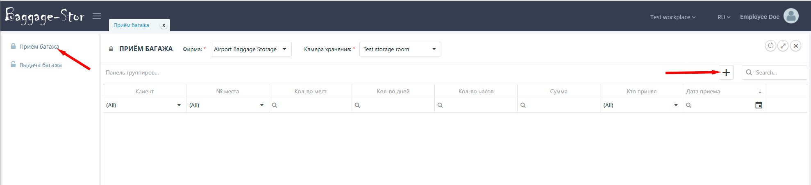

## The employee adds a client, assigns a storage location, and the price is calculated.
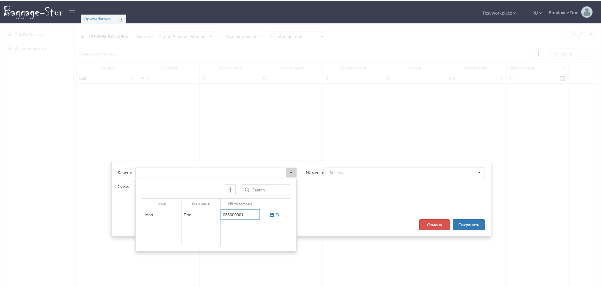

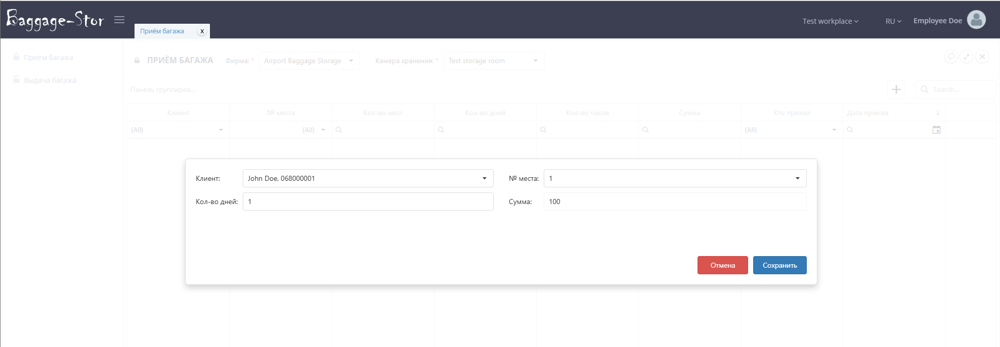

## Luggage accepted for storage
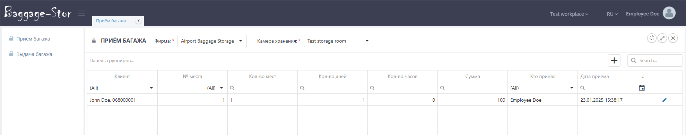

## To check-out baggage, simply click the "Delivery" button

## Baggage has been checked-out
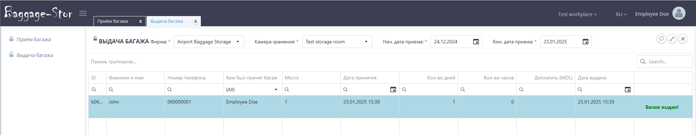
