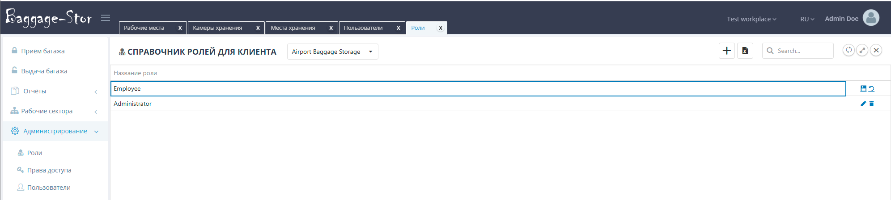
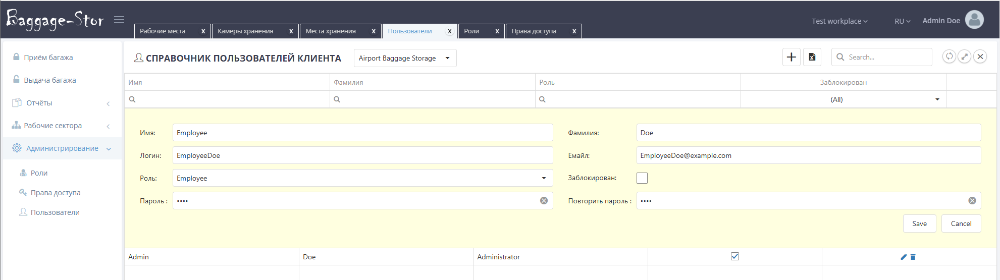
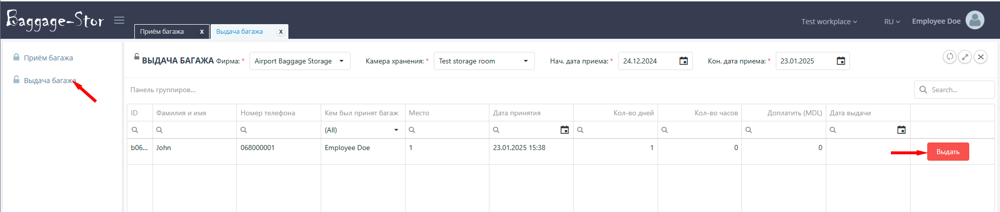

# BaggageStorage
This project is designed for check-in and check-out baggage in storage rooms. The project supports more than one worksplace, the system administrator only needs to register the client enterprise, assign an administrator, and then register employees, assign them roles, or delegate this to the administrator.

